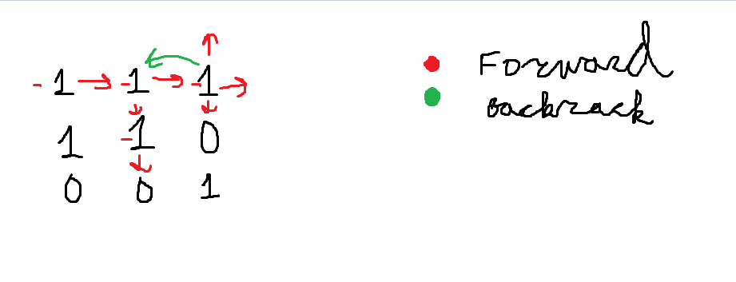
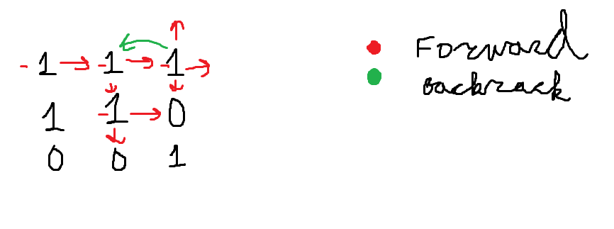

# Problem asks us to find number of islands.
***I have considered two approaches: a depth-first search solution and a breadth-first search solution.***

## Structure and usage

Run `bfs.py` to try out bfs solution.
Run `dfs.py` to try out dfs solution.
Run  `test_solutions.py` to test solutions on different test cases.

## Approaches:
**In this section, we are going to review approaches that we implemented, as well as their complexities.**

### BFS

We step on the island and go line by line to neighbouring land cells.
If we step into water or already marked land, we do not add it to the queue of visited cells.

Step-by-step visualization:

After some time we would get:

And then we would call our bfs function again for different island:

**Time complexity:**  O(n * m)

**Space complexity:**  O(number_of_neighbours_on_current_level)

### DFS

In this approach we go in depth and then when we can not go any deeper we go to previous cell and try to go deeper from there.

Step-by-step visualization:

**Time complexity:**  O(n * m)

**Space complexity:**  O(recursion_stack)

## Notes:
We assume that our input will be in correct format.

